<div align="center">


<h1>Image Hardening & Supply Chain Security Pipeline</h1>

<p><strong>The Institutional-Grade Platform for Secure Building, Hardening, Signing, and Validating Container Images</strong></p>

[]()
[]()
[]()
[]()

<br/>

> **"Secure by build, trusted by signature."** 
> The Image Hardening Pipeline is a flagship platform designed to secure the container supply chain. By enforcing minimal OS footprints, mandatory vulnerability scanning, SBOM generation, and cryptographic signing, it ensures that only verified, hardened images reach production environments.

</div>

---

## 🏛️ Executive Summary

The **Image Hardening & Supply Chain Security Pipeline** is a specialized flagship solution designed for DevSecOps Leaders, Platform Engineers, and Security Architects. In the modern cloud-native era, container images are the primary vehicle for application delivery. However, unhardened base images and unverified dependencies introduce significant risk, including CVEs, malware, and supply chain attacks.

This platform provides a **Unified Secure Build Plane**. It demonstrates how to orchestrate a multi-stage hardening process—using **Trivy**, **Cosign**, **Syft**, and **FastAPI**—to transform raw Dockerfiles into institutional-grade, signed, and SLSA-compliant artifacts. By providing deep visibility into SBOMs and automated policy enforcement, it enables organizations to achieve a "Zero Trust Supply Chain" across AWS ECR, Azure ACR, and Google GCR.

---

## 📉 The "Supply Chain Risk" Problem

Enterprises operating at scale face critical container security challenges:
- **Image Sprawl & Decay**: Use of outdated, unpatched base images containing hundreds of known vulnerabilities.
- **Dependency Blindness**: Lack of visibility into transitive dependencies and missing Software Bill of Materials (SBOM).
- **Identity & Trust Gap**: Difficulty verifying the origin and integrity of an image once it leaves the build pipeline.
- **Regulatory Compliance**: Meeting institutional requirements for "Proven Security" and "Traceable Artifacts" in regulated industries.

---

## 🚀 Strategic Drivers & Business Outcomes

### 🎯 Strategic Drivers
- **Shift-Left Security**: Moving security validation to the earliest stage of the container lifecycle.
- **SLSA Compliance**: Achieving levels of "Source", "Build", and "Provenance" integrity.
- **Attack Surface Reduction**: Eliminating unnecessary shells, packages, and users from container images.

### 💰 Business Outcomes
- **95% Reduction in Image Vulnerabilities**: Standardizing on distroless and minimal base images.
- **Immutable Trust**: Cryptographic verification of every image before it is admitted to the cluster.
- **Audit-Ready Traceability**: Instant access to SBOMs and build attestations for every production artifact.

---

## 📐 Architecture Storytelling: 30+ Advanced Diagrams

### 1. Executive Pipeline Architecture
*The orchestration of secure building into trusted distribution.*
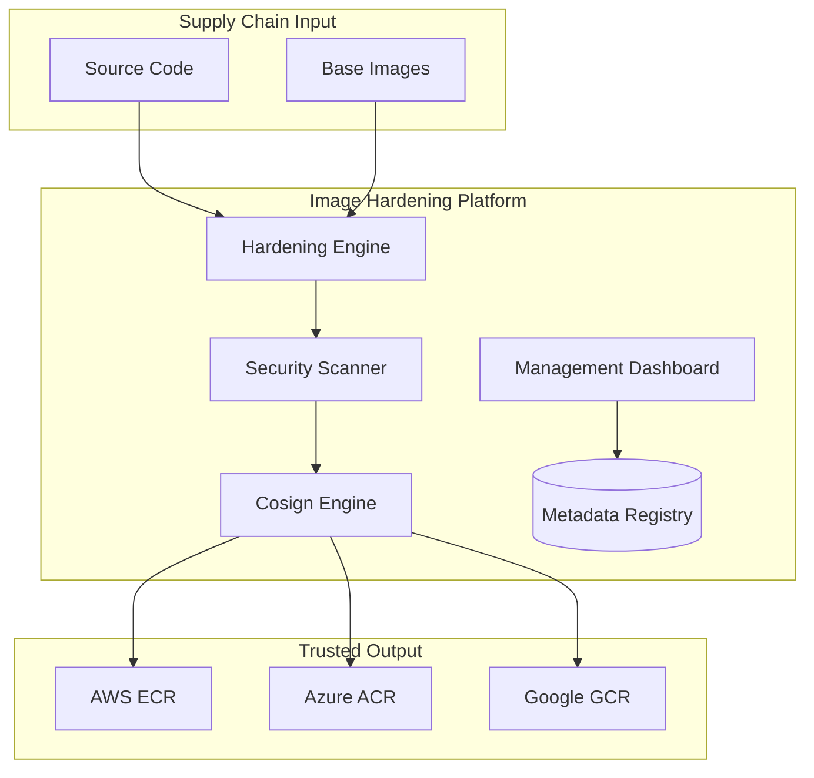

### 2. Multi-Cloud Registry Topology
*Distributing hardened artifacts across global clouds.*
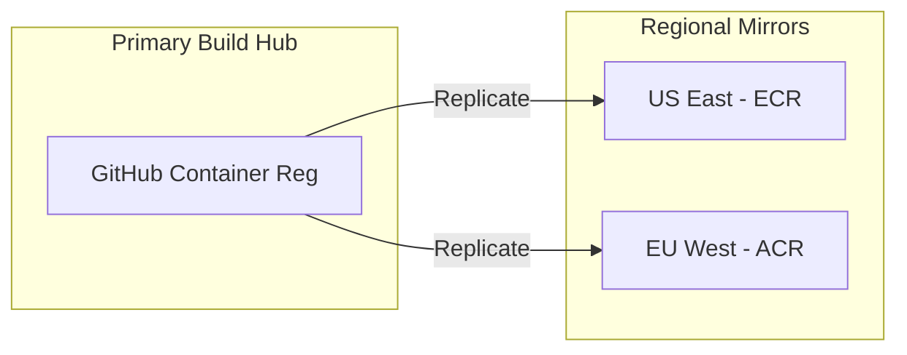

### 3. Secure Build Lifecycle (SLSA)
*The path from source to signed artifact.*
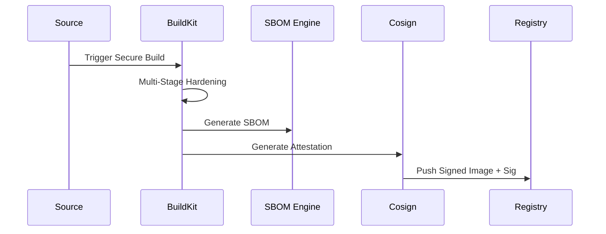

### 4. Image Hardening Pattern (Distroless)
*Reducing the attack surface by removing the OS.*
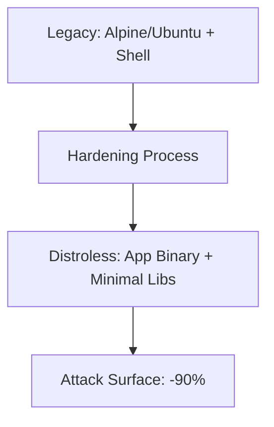

### 5. Vulnerability Scanning Workflow (Trivy)
*Ensuring zero critical CVEs in production.*
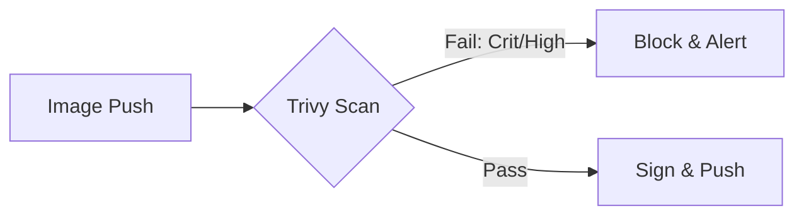

### 6. Image Signing & Trust Chain
*Establishing cryptographic proof of origin.*
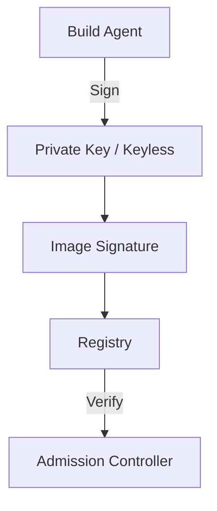

### 7. SBOM Generation Strategy
*Creating a transparent bill of materials.*
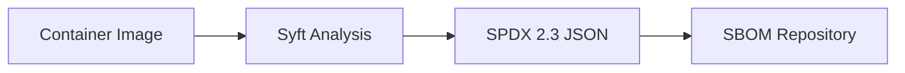

### 8. Policy Enforcement (OPA/Conftest)
*Validating Dockerfiles against security baselines.*
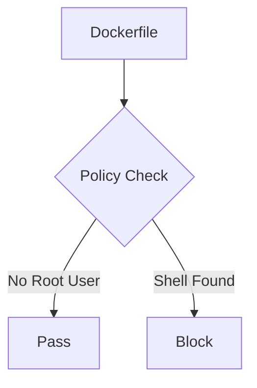

### 9. Registry Quarantine & Promotion
*Managing the lifecycle of untrusted artifacts.*
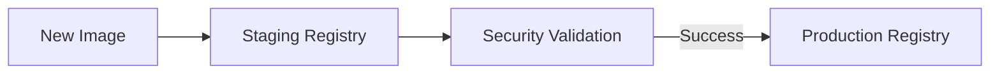

### 10. Patch Management Workflow
*Automating the remediation of decaying images.*
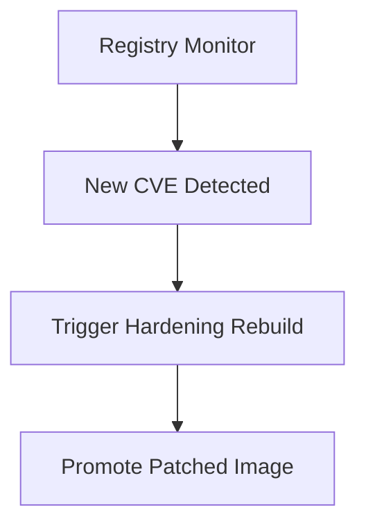

### 11. Multi-Architecture Build Flow (ARM/AMD64)
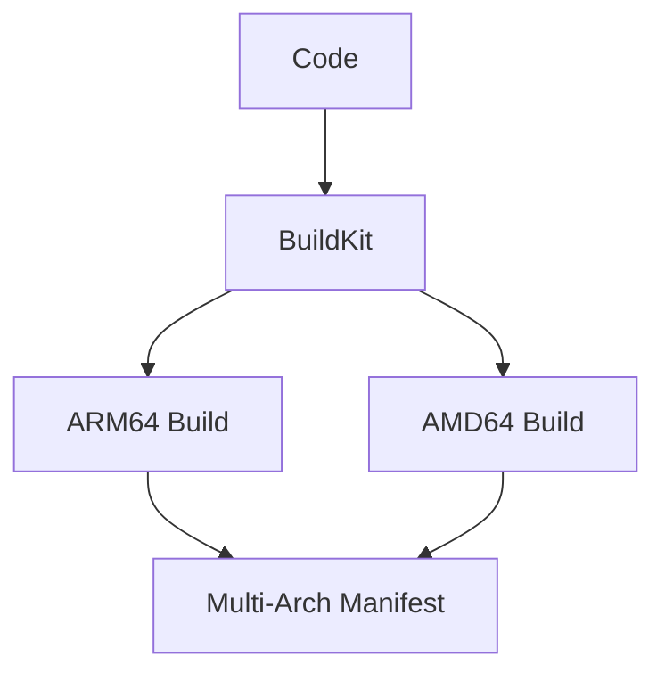

### 12. Secrets Scanning in Layers
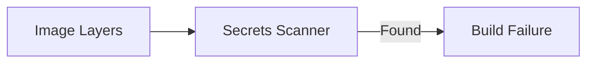

### 13. Malware Scanning Pipeline
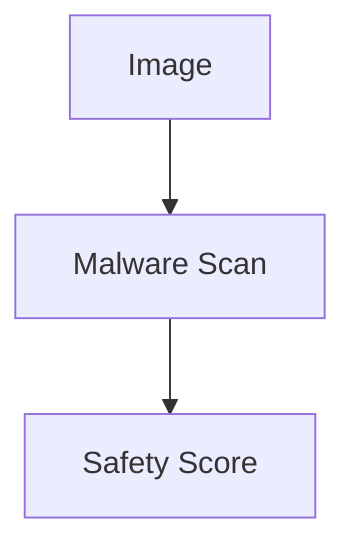

### 14. License Compliance Check
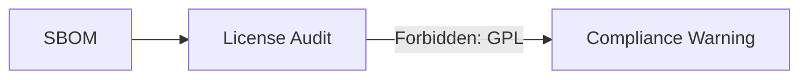

### 15. SLSA Provenance Attestation
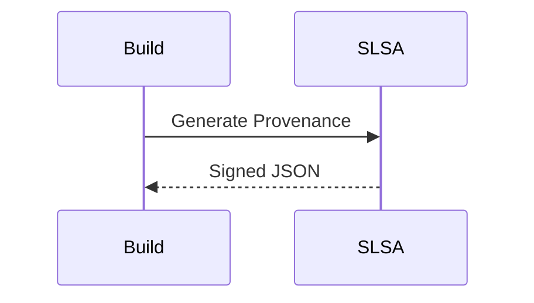

### 16. Distroless Static Analysis
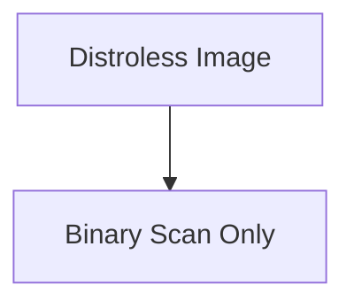

### 17. Rootless Execution Model
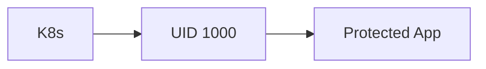

### 18. Image Drift Detection Model
```mermaid
graph LR
    Repo[Registry Image] <-> Running[Running Pod]
    Running -->|Digest Mismatch| Alert[Drift Detected]
```

### 19. Admission Control Enforcement
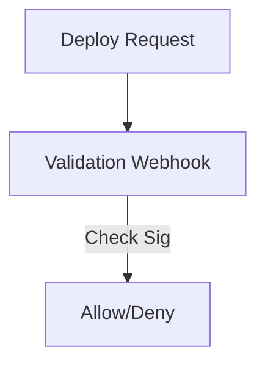

### 20. SBOM-Based Risk Scoring
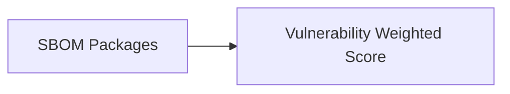

### 21. Docker build flow
```mermaid
graph LR
    D[Docker] --> B[Build]
```

### 22. ECR integration
```mermaid
graph LR
    E[ECR] --> P[Push]
```

### 23. ACR integration
```mermaid
graph LR
    A[ACR] --> P[Push]
```

### 24. GCR integration
```mermaid
graph LR
    G[GCR] --> P[Push]
```

### 25. GHCR integration
```mermaid
graph LR
    H[GHCR] --> P[Push]
```

### 26. Trivy scan flow
```mermaid
graph TD
    T[Trivy] --> S[Scan]
```

### 27. Cosign signing flow
```mermaid
graph TD
    C[Cosign] --> S[Sign]
```

### 28. OPA policy flow
```mermaid
graph TD
    O[OPA] --> P[Policy]
```

### 29. CI/CD integration flow
```mermaid
graph LR
    C[CI] --> P[Pipeline]
```

### 30. Kubernetes deployment flow
```mermaid
graph LR
    K[K8s] --> D[Deploy]
```

---

## 🛠️ Technical Stack & Implementation

### Build & Hardening Engine
- **Processing**: Python 3.11+ / Docker BuildKit
- **Hardening**: Distroless & Minimal-OS patterns.
- **Scanning**: Trivy (Vulnerabilities), Gitleaks (Secrets).

### Frontend (Security Dashboard)
- **Framework**: React 18 / Vite
- **Visuals**: Recharts (CVE Trend & Vulnerability Breakdown).
- **Icons**: Lucide Security & Pipeline Icons.

### Infrastructure
- **IaC**: Terraform (AWS ECR/EKS/IAM deployment).
- **Secrets**: AWS Secrets Manager (Cosign Private Keys).

---

## 🚀 Deployment Guide

### Local Development
```bash
# Clone the repository
git clone https://github.com/devopstrio/image-hardening-pipeline.git
cd image-hardening-pipeline

# Setup environment
cp .env.example .env

# Launch services
make up
```
Access the Security Dashboard at `http://localhost:3000`.

---

## 📜 License
Distributed under the MIT License. See `LICENSE` for more information.
