<div align="center">


<h1>Image Hardening Pipeline</h1>

<p><strong>The Institutional-Grade Platform for Secure Building, Hardening, Signing, and Validating Container Images.</strong></p>

[]()
[]()
[]()

<br/>

> **"Secure by build, trusted by signature."** 
> **Image Hardening Pipeline** is an enterprise-grade platform designed to provide a secure, measurable, and highly automated foundation for global container operations. It orchestrates the complex lifecycle of image security—from multi-stage CIS/STIG hardening and automated vulnerability scanning to cryptographic signing (Cosign) and unified supply chain governance.

</div>

---

## 🏛️ Executive Summary

Fragmented image build processes and manual vulnerability patching are strategic operational liabilities; lack of centralized image orchestration is a primary barrier to organizational container security. Organizations fail to maintain a secure supply chain not because of a lack of base images, but because of fragmented hardening standards, lack of automated signing validation, and an inability to orchestrate image landing zones with operational precision.

This platform provides the **Hardening Intelligence Plane**. It implements a complete **Enterprise Hardening-as-Code Framework**, enabling Security and Platform teams to manage global image security as first-class citizens. By automating the identification of vulnerabilities through real-time layer analysis and orchestrating the generation of SLSA-compliant attestations, we ensure that every organizational artifact—from core OS base images to application-specific microservice containers—is hardened by default, audited for history, and strictly aligned with institutional security frameworks.

---

## 📐 Architecture Storytelling: Principal Reference Models

### 1. Principal Architecture: Global Image Hardening & Compliance Intelligence Plane
This diagram illustrates the end-to-end flow from multi-cloud base image ingestion and CIS/STIG hardening to automated vulnerability scanning, cryptographic signing, and institutional artifact auditing.

```mermaid
graph LR
    %% Subgraph Definitions
    subgraph ImageIngress["Base Image & Source Ingress"]
        direction TB
        UpstreamRegistries["DockerHub / Quay / ECR Base"]
        SourceCode["GitLab / GitHub Source"]
        OS_Distros["Alpine / Ubuntu / Distroless"]
    end

    subgraph IntelligenceEngine["Hardening Intelligence Hub"]
        direction TB
        API["FastAPI Hardening Gateway"]
        HardeningEngine["CIS / STIG Hardening Hub"]
        ScanOrch["Vulnerability & Malware Orch"]
        SigningHub["Cosign & Attestation Hub"]
    end

    subgraph OperationsPlane["Distributed Hardening Fleet"]
        direction TB
        BuildWorkers["Multi-Stage Build Runners"]
        SBOMEngines["SBOM Generation Workers"]
        SigningProxies["Cryptographic Trust Proxies"]
    end

    subgraph OperationsHub["Institutional Image Hub"]
        direction TB
        Scorecard["Image Maturity Score"]
        Analytics["CVE Trend & Build Stats"]
        Audit["Forensic Image Metadata Lake"]
    end

    subgraph DevOps["Hardening-as-Code Framework"]
        direction TB
        TF["Terraform Hardening Modules"]
        DriftBot["Base Image Drift Validator"]
        ChatOps["Image Approval Hub"]
    end

    %% Flow Arrows
    ImageIngress -->|1. Submit Image/Source| API
    API -->|2. Execute Hardening| HardeningEngine
    HardeningEngine -->|3. Run Security Scan| ScanOrch
    ScanOrch -->|4. Sign & Attest| SigningHub
    
    SigningHub -->|5. Execute Distribution| OperationsPlane
    OperationsPlane -->|6. Notify Status| ChatOps
    API -->|7. Visualize Health| Scorecard
    
    Scorecard -->|8. Track CVEs| Analytics
    Scorecard -->|9. Record Provenance| Audit
    
    TF -->|10. Provision Hub| IntelligenceEngine
    DriftBot -->|11. Inject Drift Risk| HardeningEngine
    Audit -->|12. Improve Hardening| BuildWorkers

    %% Styling
    classDef ingress fill:#f5f5f5,stroke:#616161,stroke-width:2px;
    classDef intel fill:#e8eaf6,stroke:#1a237e,stroke-width:2px;
    classDef operations fill:#e1f5fe,stroke:#01579b,stroke-width:2px;
    classDef ops fill:#ede7f6,stroke:#311b92,stroke-width:2px;
    classDef devops fill:#e8f5e9,stroke:#1b5e20,stroke-width:2px;

    class ImageIngress ingress;
    class IntelligenceEngine intel;
    class OperationsPlane operations;
    class OperationsHub ops;
    class DevOps devops;
```

### 2. The Image Hardening Lifecycle Flow
The continuous path of a container image from initial base ingestion and patching to active CIS/STIG hardening, vulnerability scanning, cryptographic signing, and institutional forensic auditing.

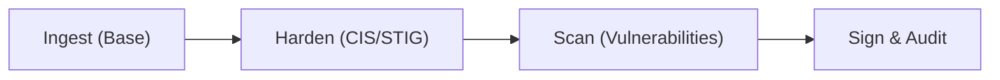

### 3. Distributed Multi-Cloud Image Factory Topology
Strategically orchestrating image builds across global environments (AWS AMI, Azure SIG, GCP GCE, and Docker), providing a unified institutional view of global image security and artifact readiness.

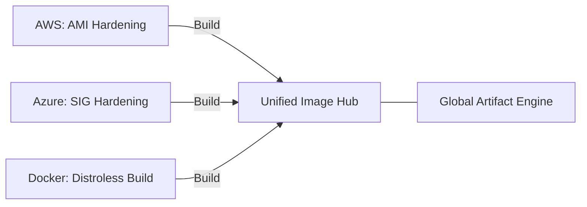

### 4. CIS Benchmark & STIG Policy Validation Flow
Executing complex logic for evaluating container images against industry-standard hardening rules via policy-as-code, ensuring every organizational artifact is secure and compliant before distribution.

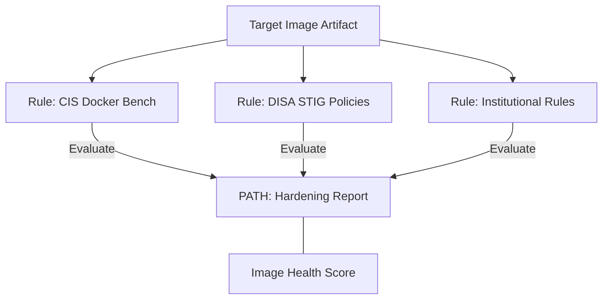

### 5. Secure Image Signing & Attestation Flow
Automatically generating and vaulting cryptographic signatures and SLSA-compliant attestations for every hardened image, ensuring institutional trust and proof of origin for every production workload.

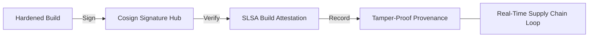

### 6. Continuous Verification & Runtime Admission Flow
Managing the lifecycle of a deployment request, automatically verifying image signatures and hardening attestations before admitting the artifact to the runtime environment, ensuring zero-latency security confidence.

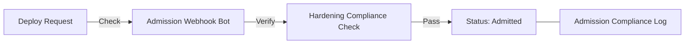

### 7. Institutional Image Quality Maturity Scorecard
Grading organizational performance based on key indicators: Vulnerability Count (CVEs), Hardening Coverage, and Build Success Rate.

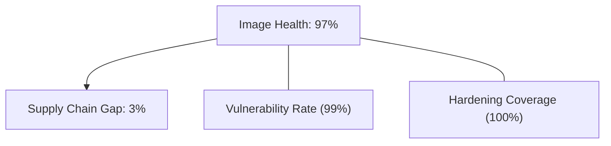

### 8. Identity & RBAC for Image Governance
Managing fine-grained access to build pipelines, signing keys, and audit logs between Image Architects, Security Auditors, and Workload Owners.

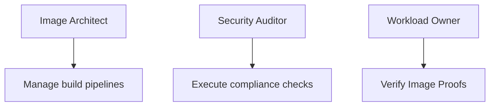

### 9. IaC Deployment: Hardening-as-Code Framework
Using modular Terraform to deploy and manage the versioned distribution of the image tracking hubs, hardening workers, and forensic metadata lakes.

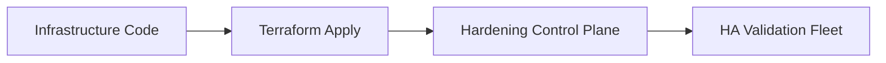

### 10. AIOps Vulnerability Trend & Drift Validation Flow
Using advanced analytics to identify sudden surges in CVE counts, suspicious base image drifts, or unusual build velocities that could result in institutional risk.

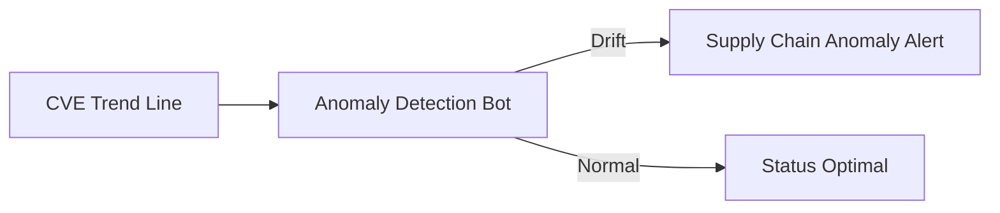

### 11. Metadata Lake for Forensic Image Audit
Storing long-term records of every image built, every scan result recorded, and every signing event for institutional record-keeping, compliance auditing, and post-build forensics.

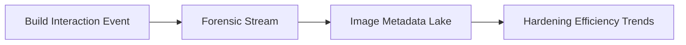

---

## 🏛️ Core Hardening Pillars

1.  **Unified Artifact Coordination**: Maximizing resilience by centralizing all image hardening through a single institutional plane.
2.  **Automated Vulnerability Scanning**: Eliminating "toxic artifact" scenarios through proactive layer and malware verification.
3.  **Sequential Build Intelligence**: Ensuring zero-interruption distribution through dependency-aware multi-stage builds.
4.  **Zero-Trust Supply Protection**: Automatically enforcing image signing and identity-based access across all registries.
5.  **Autonomous Compliance Logic**: Guaranteeing security through automated industry-specific CIS/STIG monitoring runbooks.
6.  **Full Image Auditability**: Immutable recording of every build provenance and scan result for institutional forensics.

---

## 🛠️ Technical Stack & Implementation

### Hardening Engine & APIs
*   **Framework**: Python 3.11+ / FastAPI.
*   **Build Hub**: Managed Docker BuildKit with multi-stage and cross-arch (ARM/AMD) support.
*   **Security Core**: Trivy (Vulnerabilities), Grype (Scanning), and Syft (SBOM generation).
*   **Persistence**: PostgreSQL (Image Ledger) and Redis (Live Job State).
*   **Auth Orchestrator**: Federated OIDC/SAML for least-privilege image management access.

### Governance Dashboard (UI)
*   **Framework**: React 18 / Vite.
*   **Theme**: Dark, Indigo, Emerald (Modern high-fidelity security aesthetic).
*   **Visualization**: D3.js for registry topologies and Recharts for CVE velocity analytics.

### Infrastructure & DevOps
*   **Runtime**: AWS EKS or Azure Kubernetes Service (AKS) for management plane.
*   **Trust Hub**: Cosign (Sigstore) for keyless image signing and attestation.
*   **IaC**: Modular Terraform for deploying the image factory and validation fleet.

---

## 🏗️ IaC Mapping (Module Structure)

| Module | Purpose | Real Services |
| :--- | :--- | :--- |
| **`infrastructure/image_hub`** | Central management plane | EKS, PostgreSQL, Redis |
| **`infrastructure/workers`** | Distributed build & scan fleet | K8s Workers, Cloud APIs |
| **`infrastructure/trust`** | Cryptographic signing hubs | Cosign, KMS, OIDC |
| **`infrastructure/auditing`** | Forensic image sinks | S3, Athena, Quicksight |

---

## 🚀 Deployment Guide

### Local Principal Environment
```bash
# Clone the hardening platform
git clone https://github.com/devopstrio/image-hardening-pipeline.git
cd image-hardening-pipeline

# Configure environment
cp .env.example .env

# Launch the Hardening stack
make init

# Trigger a mock image ingestion and automated hardening simulation
make simulate-hardening
```

Access the Security Dashboard at `http://localhost:3000`.

---

## 📜 License
Distributed under the MIT License. See `LICENSE` for more information.

---
<div align="center">
  <p>© 2026 Devopstrio. All rights reserved.</p>
</div>
