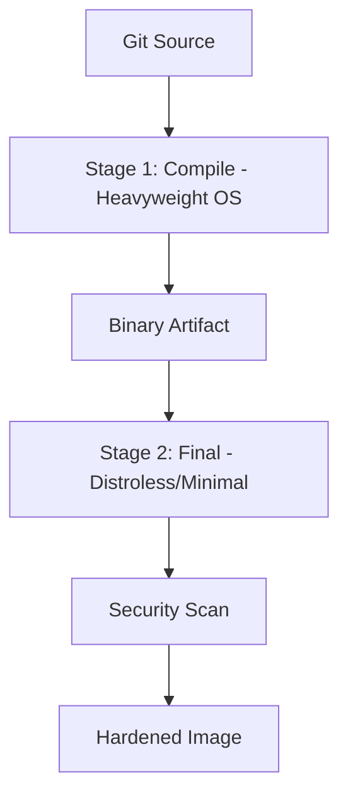
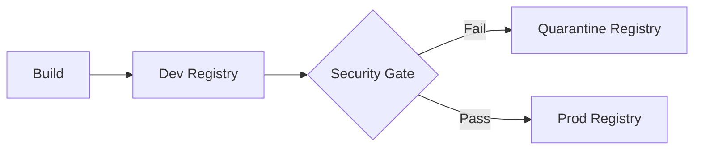
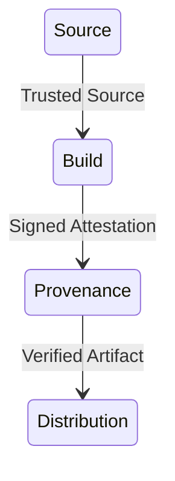

# Architecture & Build Diagrams

## 11. Secure Multi-Stage Build Flow (Detailed)
*How the build engine enforces isolation and minimal footprints.*

## 13. Image Promotion & Quarantine Flow

## 20. SLSA Compliance Model

