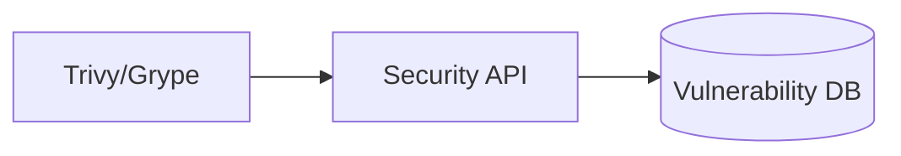
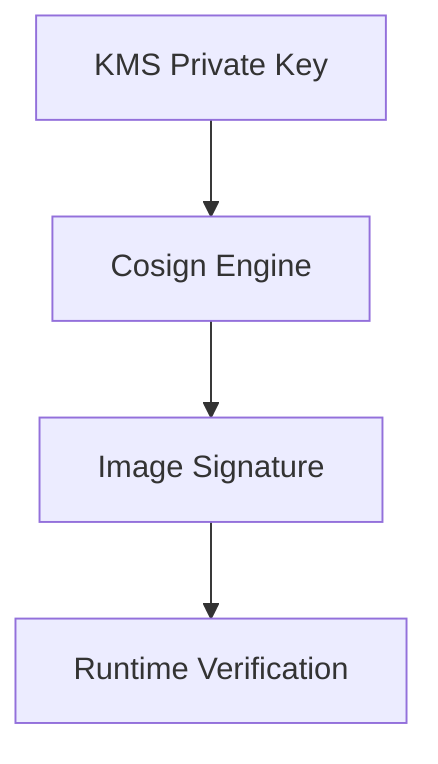
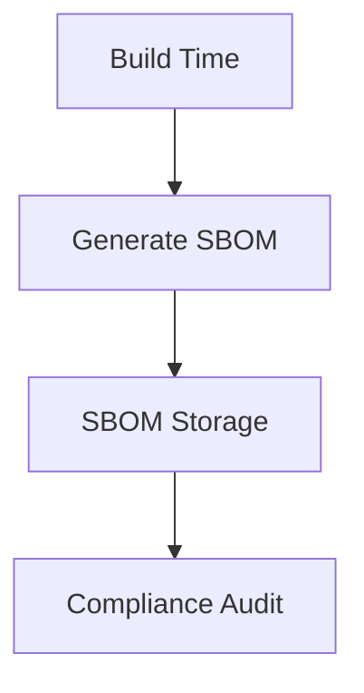

# Security & Supply Chain Diagrams

## 31. Vulnerability Ingestion Pipeline

```mermaid
graph LR
    Scanner[Trivy/Grype] --> API[Security API]
    API --> DB[(Vulnerability DB)]
```

## 34. Image Signing Trust Chain

```mermaid
graph TD
    Key[KMS Private Key] --> Cosign[Cosign Engine]
    Cosign --> Signature[Image Signature]
    Signature --> Verification[Runtime Verification]
```

## 40. SBOM Lifecycle Management

```mermaid
graph TD
    Build[Build Time] --> Gen[Generate SBOM]
    Gen --> Store[SBOM Storage]
    Store --> Audit[Compliance Audit]
```
